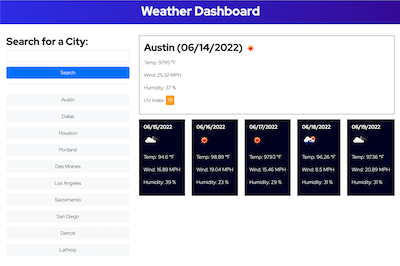

# Weather Dashboard

This weather dashboard uses open source APIs to allow a user to search for a city and see the current + five day forecast.

## Features
* Displays current weather information and 5-day forecast
* Saves up to 10 cities worth of seach history
* Allows users to clear seach history

## Deployed Application
[Weather Dashboard](https://hellovolcano.github.io/weather-dashboard/)

## Credits
Data and images provided by [Open Weather Map](https://openweathermap.org/)